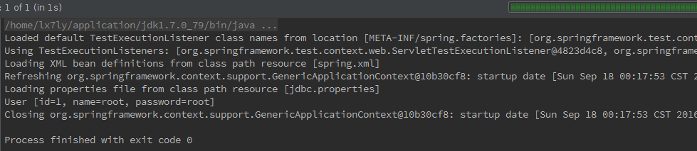
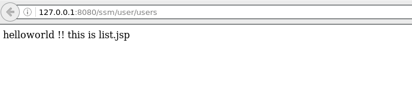

注意：这里使用了mybatis3.2.1版本，刚开始用了3.4.1的版本，会报一个很奇怪的错(java.lang.AbstractMethodError: org.mybatis.spring.transaction.SpringManagedTransaction.getTimeout()Ljava/lang/Integer;)，换了这个包就好了
1. 所需包，spring的jar包，mybatis的jar包，spring-mybatis.jar，数据库连接的mysql-connection.jar，日志的log4j.jar（33个包，如果用到了jstl还需要加入jstl包，36个）
file:spring4.1.3+springmvc+mybatis3.2.1_files/71b3542d-6a62-4517-8365-782e3cc0e4bb.png
2.  在web.xml中添加spring的监听，以及配置springmvc的核心文件。
```
<?xml version="1.0" encoding="UTF-8"?>
<web-app version="2.5" 
xmlns="http://java.sun.com/xml/ns/javaee" 
xmlns:xsi="http://www.w3.org/2001/XMLSchema-instance" 
xsi:schemaLocation="http://java.sun.com/xml/ns/javaee 
http://java.sun.com/xml/ns/javaee/web-app_2_5.xsd">
  <display-name></display-name>
  <!-- spring文件的监听 -->
   <listener>
        <listener-class>org.springframework.web.context.ContextLoaderListener</listener-class>
    </listener>
  <!-- spring 加载配置文件的路径 -->
  <context-param>
    <param-name>contextConfigLocation</param-name>
    <param-value>classpath:beans.xml</param-value>
  </context-param>  
  <!-- 配置springmvc核心控制器 -->
   <servlet>
        <servlet-name>spring</servlet-name>
        <servlet-class>org.springframework.web.servlet.DispatcherServlet</servlet-class>
        <load-on-startup>1</load-on-startup>
   </servlet>
    <servlet-mapping>
        <servlet-name>spring</servlet-name>
        <url-pattern>/</url-pattern>
    </servlet-mapping>
    <!-- 加个过滤器，让所有请求页面的编码方式都为utf-8 -->
<filter>
   <filter-name>CharEncodingFilter</filter-name>
   <filter-class>com.sram.filter.CharEncodingFilter</filter-class>
   <init-param>
   <param-name>encoding</param-name>
   <param-value>UTF-8</param-value>
   </init-param>
  </filter>
  
  <filter-mapping>
   <filter-name>CharEncodingFilter</filter-name>
   <!-- /*表示所有的请求都过滤 -->
   <url-pattern>/*</url-pattern>
  </filter-mapping>
  
  <welcome-file-list>
    <welcome-file>index.jsp</welcome-file>
  </welcome-file-list>
</web-app>
```
至此，web.xml文件配置结束

3.  在WEB-INF目录添加spring-servlet.xml（ps:web.xml中配置的servlet核心名字叫spring，它就会去找叫spring-servlet.xml的springmvc配置文件）
配置如下：
```
<?xml version="1.0" encoding="UTF-8"?>
<beans xmlns="http://www.springframework.org/schema/beans" 
xmlns:mvc="http://www.springframework.org/schema/mvc"
    xmlns:xsi="http://www.w3.org/2001/XMLSchema-instance"
    xmlns:p="http://www.springframework.org/schema/p" 
    xmlns:context="http://www.springframework.org/schema/context"
    xsi:schemaLocation="
        http://www.springframework.org/schema/beans 
        http://www.springframework.org/schema/beans/spring-beans-3.0.xsd
        http://www.springframework.org/schema/context 
        http://www.springframework.org/schema/context/spring-context-3.0.xsd
        http://www.springframework.org/schema/mvc
        http://www.springframework.org/schema/mvc/spring-mvc-3.0.xsd">
 
<!-- 注解探测器 -->
<context:component-scan base-package="com.sram.controller"/>
<!-- 打开mvc驱动 -->
<mvc:annotation-driven />
    <bean 
      class="org.springframework.web.servlet.view.InternalResourceViewResolver">
    <property name="prefix" value="/WEB-INF/jsp/"/>
    <property name="suffix" value=".jsp"/>
</bean>
 
</beans>
```
4.  在src目录下添加spring的配置文件，beans.xml，内容如下：
```
<?xml version="1.0" encoding="UTF-8"?>
<beans xmlns="http://www.springframework.org/schema/beans"
     xmlns:xsi="http://www.w3.org/2001/XMLSchema-instance"
     xmlns:context="http://www.springframework.org/schema/context"
     xmlns:aop="http://www.springframework.org/schema/aop"
     xmlns:tx="http://www.springframework.org/schema/tx"
     xsi:schemaLocation="http://www.springframework.org/schema/beans
         http://www.springframework.org/schema/beans/spring-beans-3.0.xsd
         http://www.springframework.org/schema/context
         http://www.springframework.org/schema/context/spring-context-3.0.xsd
         http://www.springframework.org/schema/aop 
         http://www.springframework.org/schema/aop/spring-aop-3.0.xsd 
         http://www.springframework.org/schema/tx 
         http://www.springframework.org/schema/tx/spring-tx-3.0.xsd ">
 
<!-- 打开spring的Annotation -->
<context:annotation-config/>
<!-- 设置spring去哪些包中找Annotation -->
    <context:component-scan base-package="com.sram"/>
    
    
    <!-- 创建数据库连接 -->
    <bean id="dataSource" class="org.apache.commons.dbcp.BasicDataSource" destroy-method="close">
    <property name="driverClassName" value="${jdbc.driverClassName}"/>
    <property name="url" value="${jdbc.url}"/>
    <property name="username" value="${jdbc.username}"/>
    <property name="password" value="${jdbc.password}"/>
</bean>
<!-- 引入src目录下的jdbc.properties文件 -->
    <context:property-placeholder location="classpath:jdbc.properties"/>
    
<!-- 创建spring的SqlSessionFactory -->
<bean id="sqlSessionFactory" 
class="org.mybatis.spring.SqlSessionFactoryBean">
    <property name="dataSource" ref="dataSource"/>
     
  <!-- 加载实体类映射文件 -->
  <property name="mapperLocations" value="classpath:com/sram/model/*.xml"></property>
<!--  加载实体类对象 -->
<property name="typeAliasesPackage" value="com.sram.model"></property>
 </bean>
 
<!-- 配置spring的事务处理 -->
 <!-- 创建 事务管理器 -->
 <bean id="txManager" class="org.springframework.jdbc.datasource.DataSourceTransactionManager">
  <property name="dataSource" ref="dataSource"></property>
 </bean>
 <!-- 配置aop,spring是通过aop进行事务管理 -->
 <aop:config>
  <!-- 设置在哪些方法中打开事务 -->
    <aop:pointcut id="allMethods" 
            expression="execution(* com.sram.dao.*.*(..))"/>
    <!-- 加入事务控制的具体位置 -->
    <aop:advisor advice-ref="txAdvice" pointcut-ref="allMethods"/>
  </aop:config>
  <!-- 配置哪些方法要加入事务控制 -->
  <tx:advice id="txAdvice" transaction-manager="txManager">
   <tx:attributes>
   <!-- 所有方法加入事务 -->
   <tx:method name="*" propagation="REQUIRED"/>
   </tx:attributes>
  </tx:advice>
 
</beans>
```
5. 数据源文件jdbc.properties内容如下
jdbc.driverClassName=com.mysql.jdbc.Driver
jdbc.url=jdbc:mysql://localhost:3306/mybatis
jdbc.username=root
jdbc.password=root

6.  日志文件log4j.properties
```
log4j.rootLogger=INFO, stdout  
#log4j.logger.test=info  
#log4j.logger.org.apache.jasper = DEBUG  
#log4j.logger.org.apache.catalina.startup.TldConfig = DEBUG  
#log4j.logger.org.apache.catalina.session.ManagerBase = DEBUG  
#log4j.logger.com.fiscal = DEBUG  
#log4j.logger.com.system = DEBUG  
log4j.logger.com.ibatis = DEBUG  
log4j.logger.com.ibatis.common.jdbc.SimpleDataSource = DEBUG  
log4j.logger.com.ibatis.common.jdbc.ScriptRunner = DEBUG  
log4j.logger.com.ibatis.sqlmap.engine.impl.SqlMapClientDelegate = DEBUG  
log4j.logger.java.sql.Connection = DEBUG  
log4j.logger.java.sql.Statement = DEBUG  
log4j.logger.java.sql.PreparedStatement = DEBUG 
log4j.logger.java.sql.ResultSet = INFO  
log4j.appender.stdout=org.apache.log4j.ConsoleAppender   
#log4j.appender.fileout=org.apache.log4j.RollingFileAppender  
#log4j.appender.fileout.File=e:/log/ibatis.log   
#log4j.appender.fileout.MaxFileSize=10000KB   
log4j.appender.stdout.layout=org.apache.log4j.PatternLayout   
#log4j.appender.stdout.layout.ConversionPattern=[%-5p] %d{yyyy-MM-dd HH:mm:ss} :%m%n   
#log4j.appender.fileout.layout=org.apache.log4j.PatternLayout   
#log4j.appender.fileout.layout.ConversionPattern=[%-5p]_%d{yyyy-MM-dd HH:mm:ss} :%m%n  
#log4j.appender.stdout.layout=org.apache.log4j.SimpleLayout   
# log4j.logger.org=info 
```
配置文件结束 jdbc.propertise和log4j.propertise放在src根目录下

7. 下面写测试代码

+  UserController.java
```
package com.tt.controller;

/**
 * Created by lx7ly on 9/17/16.
 */

import javax.annotation.Resource;

import com.tt.dao.IUserDao;
import com.tt.model.User;
import org.springframework.stereotype.Controller;
import org.springframework.ui.Model;
import org.springframework.web.bind.annotation.RequestMapping;
import org.springframework.web.bind.annotation.RequestMethod;

@Controller("userController")
@RequestMapping("user")
public class UserController {

    private IUserDao userDao;

    @Resource
    public void setUserDao(IUserDao userDao) {
        this.userDao = userDao;
    }

    public UserController() {

    }

    @RequestMapping(value = "/users", method = RequestMethod.GET)
    public String list(Model model) {
        User u = userDao.loadById(1);
        System.out.println(u);
        //model.addAttribute("users", users);
        return "list";
    }
}
```

+ CharEncodingFilter.java

```
package com.tt.filter;

import javax.servlet.*;
import java.io.IOException;

/**
 * Created by lx7ly on 9/17/16.
 */
public class CharEncodingFilter implements Filter{
    private String encoding;

   public void destroy() {

   }

   public void doFilter(ServletRequest request, ServletResponse response,
         FilterChain chain) throws IOException, ServletException {

      request.setCharacterEncoding(encoding);
      //response.setCharacterEncoding(encoding);
      chain.doFilter(request, response);
   }

   public void init(FilterConfig config) throws ServletException {

      //config中保存这过滤器的配置信息，如果在web.xml中配置的过滤器编码不是utf8，则改成utf8；
      String e = config.getInitParameter("encoding");
      if(e == null || e.equals("")) {
         encoding = "UTF-8";
      }
      else {
         encoding = e;
      }
   }
}
```

+ User.java
```
package com.tt.model;

/**
 * Created by lx7ly on 9/17/16.
 */
public class User {
    private int id;
    private String name;
    private String password;

    public User() {
    }

    public User(String name, String password) {
        super();
        this.name = name;
        this.password = password;
    }


    public User(int id, String name, String password) {
        super();
        this.id = id;
        this.name = name;
        this.password = password;
    }

    public String getName() {
        return name;
    }

    public void setName(String name) {
        this.name = name;
    }

    public String getPassword() {
        return password;
    }

    public void setPassword(String password) {
        this.password = password;
    }

    public int getId() {
        return id;
    }

    public void setId(int id) {
        this.id = id;
    }

    @Override
    public String toString() {
        return "User [id=" + id + ", name=" + name + ", password="
                + password + "]";
    }
}
```

+ User.xml
```
<?xml version="1.0" encoding="UTF-8" ?>
<!DOCTYPE mapper PUBLIC "-//mybatis.org//DTD Mapper 3.0//EN"
"http://mybatis.org/dtd/mybatis-3-mapper.dtd">
<mapper namespace="com.tt.model.User">

   <select id="load" parameterType="int" resultType="com.tt.model.User">
      select * from t_user where id = #{id}
   </select>

</mapper>
```

+ UserException.java

```
package com.tt.model;

/**
 * Created by lx7ly on 9/17/16.
 */
public class UserException extends RuntimeException {
    public UserException() {
        super();

    }

    public UserException(String message, Throwable cause,
                         boolean enableSuppression, boolean writableStackTrace) {
        super(message, cause, enableSuppression, writableStackTrace);

    }

    public UserException(String message, Throwable cause) {
        super(message, cause);

    }

    public UserException(String message) {
        super(message);

    }

    public UserException(Throwable cause) {
        super(cause);

    }
}
```

+ IUserDao.java

```
package com.tt.dao;

import com.tt.model.User;

/**
 * Created by lx7ly on 9/17/16.
 */
public interface IUserDao {
    void add(User user);

    void delete(int id);

    void update(User user);

    User loadById(int id);

    User loadByName(String username);

    User login(String username, String password);
}
```
+ UserDao.java
```
package com.tt.dao;

import com.tt.model.User;
import com.tt.model.UserException;
import org.apache.ibatis.session.SqlSession;
import org.apache.ibatis.session.SqlSessionFactory;
import org.springframework.stereotype.Repository;

import javax.annotation.Resource;

/**
 * Created by lx7ly on 9/17/16.
 */

@Repository("userDao")
public class UserDao implements IUserDao{
    private SqlSessionFactory sqlSessionFactory = null;

   @Resource
   public void setSqlSessionFactory(SqlSessionFactory sqlSessionFactory) {
      this.sqlSessionFactory = sqlSessionFactory;
   }

   public void add(User user) {

   }

   public void delete(int id) {

   }

   public void update(User user) {

   }

   @Override
   public User loadById(int id) {
      SqlSession sqlSession = null;
      User u = null;
      try{
         sqlSession = sqlSessionFactory.openSession();
         u = sqlSession.selectOne("com.tt.model.User.load", id);
      }finally{
         assert sqlSession != null;
         sqlSession.close();
      }
      return u;
   }

   public User loadByName(String username) {

      return null;
   }

   public User login(String username, String password) {
      User u = this.loadByName(username);
      if(u == null){
         throw new UserException("用户不存在");
      }else if(!password.trim().equals(u.getPassword())){
         throw new UserException("密码不对！！");
      }
      return u;
   }
}
```

+ IUserService.java
```
package com.tt.service;

import com.tt.model.User;

/**
 * Created by lx7ly on 9/17/16.
 */
public interface IUserService {

    User loadById(int id);
}
+ UserService.java

package com.tt.service;

import com.tt.dao.IUserDao;
import com.tt.model.User;
import org.springframework.stereotype.Service;

import javax.annotation.Resource;

/**
 * Created by lx7ly on 9/17/16.
 */
@Service("userService")
public class UserService implements IUserService{


    private IUserDao userDao;

    @Resource
    public void setUserDao(IUserDao userDao) {
        this.userDao = userDao;
    }

    @Override
    public User loadById(int id) {
        return userDao.loadById(1);
    }
}
```

+ UserServiceTest.java

```
package com.tt.service;

import org.junit.Test;
import org.junit.runner.RunWith;
import org.springframework.test.context.ContextConfiguration;
import org.springframework.test.context.junit4.SpringJUnit4ClassRunner;

import javax.annotation.Resource;

/**
 * Created by lx7ly on 9/17/16.
 */
@RunWith(SpringJUnit4ClassRunner.class)       //表示继承了SpringJUnit4ClassRunner类
@ContextConfiguration(locations = {"classpath:spring.xml"})
public class UserServiceTest {

    private IUserService userService;

    @Test
    public void testSetUserDao() throws Exception {

    }

    @Test
    public void testLoadById() throws Exception {
        System.out.println(userService.loadById(1));
    }

    @Resource
    public void setUserService(IUserService userService) {
        this.userService = userService;
    }

}
```
+ list.jsp
```
<%--
  Created by IntelliJ IDEA.
  User: lx7ly
  Date: 9/17/16
  Time: 5:34 PM
  To change this template use File | Settings | File Templates.
--%>
<%@ page contentType="text/html;charset=UTF-8" language="java" %>
<html>
  <head>
    <title>list.jsp</title>
  </head>
  <body>
    helloworld !! this is list.jsp
  </body>
</html>
```

+ ssm.sql
```
create database ssm;

use ssm;

create table t_user (id int primary key auto_increment, name varchar(20), password varchar(20));

insert into t_user(name, password) values ('root', 'root');
insert into t_user(name, password) values ('zhangsan', '123');
insert into t_user(name, password) values ('李四', '123');
```
8. 测试spring+mybatis

9. 测试spring+mybatis+springmvc
    > url: http://127.0.0.1:8080/ssm/user/users


#### 开发实战 (教师评价系统 , )
+ springmvc 使用ResponseBody注解标识返回的是文本不跳转路径， 如果返回json格式数据， 需要jsckson的支持，
+ 开发jspweb项目最好都使用全路径（无论是引入js还是跳转页面， 不然会很坑爹）
+ 关联查询真的是没啥必要的，全部单表查询使用各种util工具进行对象组合传输dto
 
